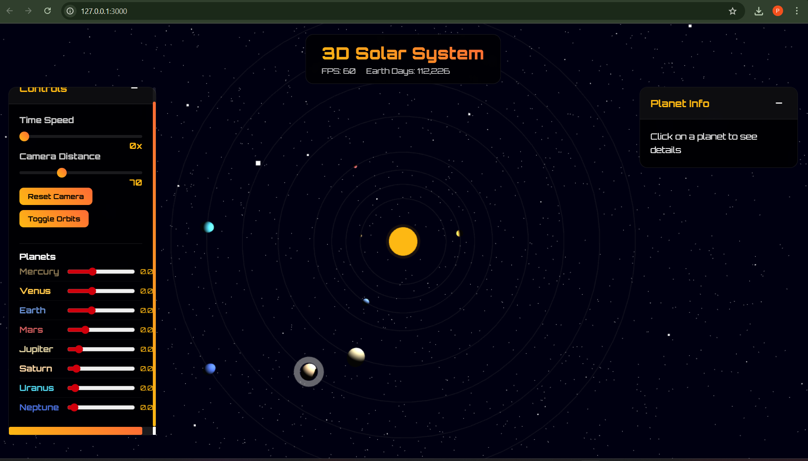

# 🌌 3D Solar System Simulation

An immersive, real-time **3D Solar System Simulation** built using [Three.js](https://threejs.org/).  
Experience the planets orbiting a glowing sun with full camera control and interactive UI.

---

## 🖼️ Demo Preview

<p align="center">
  
</p>

---

## 🚀 Features

- ☀️ **Sun** with glowing core  
- 🪐 **8 Planets** with realistic sizes, colors, and orbits  
- 🌍 Individual planet **rotation** and orbital **motion**  
- 🔭 Interactive camera via **OrbitControls** (zoom, rotate, pan)  
- 🌠 Animated **starfield background**  
- 🎛️ Control Panel:  
  - ⏱️ Global **time speed** slider  
  - 🎚️ **Individual planet speed** sliders  
  - 🛰️ **Camera distance** slider  
  - 💫 Toggle **orbit paths**  
  - ♻️ **Reset camera** to default  
- 📊 Real-time **FPS counter** & **Earth day tracker**  
- 💍 Saturn with **ring geometry**  
- 📱 Fully **responsive layout**

---

## 🛠️ Built With

- **HTML5 + CSS3**  
- **JavaScript (ES6)**  
- [**Three.js**](https://threejs.org/)  
- `OrbitControls.js` from Three.js examples

---

## 📁 Folder Structure

```
simulation/
├── index.html         # Main structure
├── style.css          # Custom styling
├── main.js            # Core Three.js logic
├── assets/            # Images or screenshots
└── README.md          # You're here!
```

---

## 🧪 Run Locally

```bash
# Install simple HTTP server (if not already)
npm install -g http-server

# Serve from project root
http-server .

# Open in your browser:
http://127.0.0.1:8080
```

---

## 📚 Learning Highlights

- 🧠 Understanding of 3D animation and orbits  
- 🎨 Lighting, material, and geometry with Three.js  
- 🕹️ UI integration with visual simulation  
- 📈 Real-time animation & performance handling

---

## 📜 License

This project is licensed under the **MIT License**.  
Feel free to use, remix, and build upon it.

---

## 🙌 Acknowledgements

- [Three.js](https://threejs.org/)  
- [OrbitControls](https://threejs.org/docs/#examples/en/controls/OrbitControls)  
- [Google Fonts – Orbitron](https://fonts.google.com/specimen/Orbitron)

---

## ✨ Author

**Purushotham E**  
🎓 BE – Information Science and Engineering  
🏫 CMR Institute of Technology, Bangalore  

[GitHub](https://github.com/purushotham2628) • [LinkedIn](https://linkedin.com/in/purushotham2628)

> If you liked this project, please ⭐ it on GitHub!
